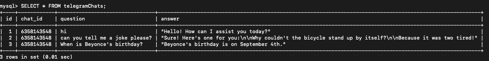

# Summer Project Queen B - OpenAI Telegram Bot

### About:
This is a telegram bot client application that answers user's question using AI technology.
The user can ask the teegram bot any question and receive an answer which is received throgh openAI, so the user will get the same answer as it would get using chatGPT.
All questions and answers are saved in a database using Mysql.

### Technologies:
openAI API, telegram API, javascript, nodeJS, Mysql.

